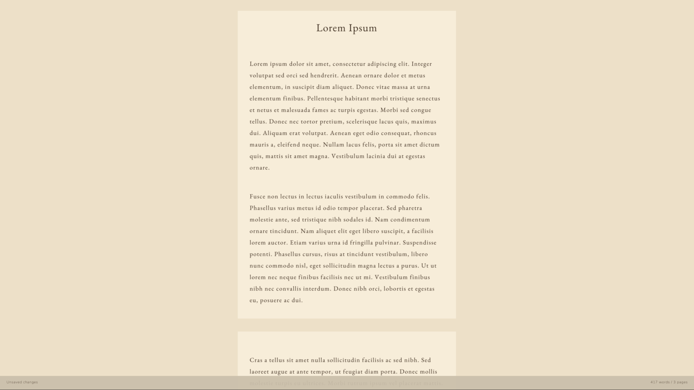

# Manuscrito

Distraction-free full screen writing app for Windows, Linux, and macOS, built with Odin and Raylib.

 

 


## Build

```sh
# Windows
.\build.ps1

# Linux/macOS
./build.sh
```

The scripts compile the bundled tinyfiledialogs C source before building the Odin app.

## Controls

- Type to write.
- `Backspace` and `Delete` delete; `Enter` inserts a new line.
- `Arrow` keys move the cursor; `Ctrl+Left/Right` moves by word; `Ctrl+Up/Down` moves by paragraph.
- `Home`/`End` jump to the start or end of the paragraph; `Ctrl+Home/End` to the start or end of the document.
- `Shift` with any movement key selects text; `Ctrl+A` selects everything.
- `Ctrl+Z` undoes; `Ctrl+Shift+Z` redoes.
- Click to place the cursor; drag or `Shift+Click` to select.
- The mouse wheel moves the cursor by paragraph; `Shift+Wheel` selects; `Ctrl+Wheel` zooms.
- `Ctrl+B`, `Ctrl+I`, `Ctrl+U`, `Ctrl+J` toggle bold, italics, underline, and strikethrough.
- `Ctrl+H` toggles a marker highlight; each theme has its own highlight color.
- `Ctrl+S` saves; `Ctrl+Shift+S` saves as; `Ctrl+O` opens; `Ctrl+N` starts a new document.
- `Ctrl+F` finds text; `Enter` in the prompt jumps to the next match.
- `Ctrl+C`, `Ctrl+X`, `Ctrl+V` copy, cut, and paste.
- `Ctrl++`, `Ctrl+-`, `Ctrl+0` zoom in, out, and reset.
- `Tab` toggles first-line indentation for the current paragraph.
- `Ctrl+P` or `Esc` opens the palette; type in it to filter commands.
- `Ctrl+Q` quits; press it again to confirm.
- `F1` opens a help screen listing every shortcut.

Quit always asks for a second press. Open and New warn about unsaved changes; run the command a second time to discard them.

All commands are also available from the palette, including headers, alignment, and themes. Toggles such as Page View and Keep Cursor Centered show their state in the palette. Page View splits the writing area into novel-sized pages of about 250 words and numbers each page.

The palette can also export the document to plain text, RTF, DOC, Markdown, or HTML. Exports carry the text plus, where the format allows, headings, paragraphs, indentation, alignment, and the bold, italic, underline, and strikethrough styles. The theme is never exported.

The status bar shows the file name on the left, a reminder to press `Ctrl+P` in the middle, and the current page next to the word and page counts on the right.

## License

GPL-3.0-only. See [`LICENSE`](https://github.com/vorvek/manuscrito/blob/main/LICENSE).
